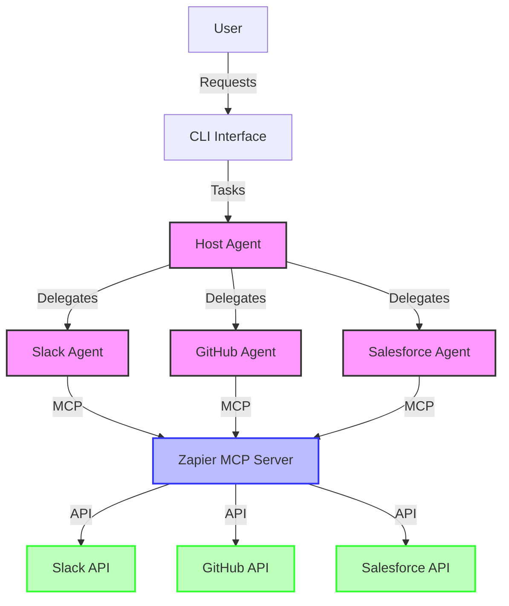
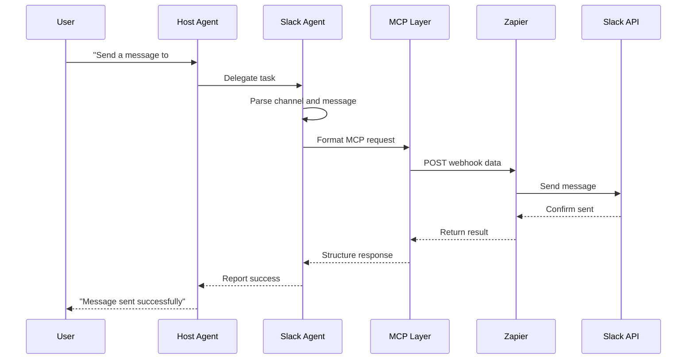
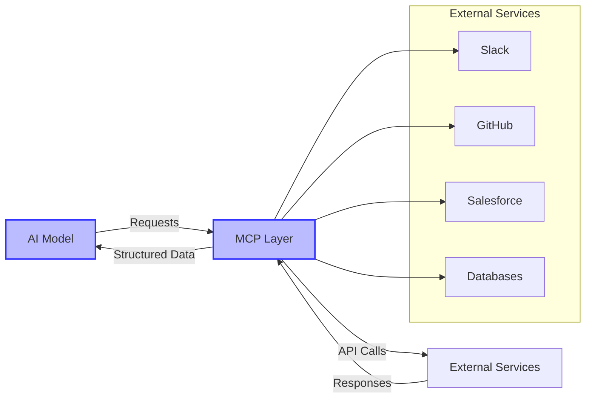

# A2A-MCP Integration Workshop

This project demonstrates how to build a multi-agent system using Agent-to-Agent (A2A) communication with the Model Context Protocol (MCP).

## Overview

The repository contains:

1. A Host Agent that intelligently routes user requests to specialized sub-agents
2. Three specialized agents:
   - **Slack Agent**: Send messages to Slack channels
   - **GitHub Agent**: Create issues in GitHub repositories
   - **Salesforce Agent**: Create, find, and update Salesforce records

Each agent connects to its respective service via the Zapier MCP Server, allowing seamless integration without direct API access.

## Architecture

```
┌─────────────┐     ┌───────────────┐
│             │     │ Slack Agent   │
│             ├────►│ (Port 41243)  │──► Slack Channels
│ Host Agent  │     └───────────────┘
│ (Port 41240)│     ┌───────────────┐
│             ├────►│ GitHub Agent  │──► GitHub Issues
│  CLI        │     │ (Port 41245)  │
│  Interface  │     └───────────────┘
│             │     ┌───────────────┐
│             ├────►│ Salesforce    │──► Salesforce
└─────────────┘     │ Agent         │    Records
                    │ (Port 41244)  │
                    └───────────────┘
```

### System Flow Diagram



### Slack Agent Flow



### A2A vs MCP

- **A2A (Agent-to-Agent)**: Protocol for communication between AI agents
- **MCP (Model Context Protocol)**: Protocol for connecting AI models to external services
- **Together**: They create a powerful ecosystem for building multi-agent systems with external integrations



## Prerequisites

- Node.js 18+
- npm or pnpm
- A free Zapier account
- A free Gemini API key
- A Slack workspace with admin privileges (for testing)

## Getting Started

1. Clone the repository
2. Install dependencies:
   ```bash
   npm install
   ```
3. Configure your `.env` file with:
   ```
   MCP_SERVER_URL=your_zapier_mcp_server_url
   GEMINI_API_KEY=your_gemini_api_key
   ```

## Running the Agents

### Start All Agents

```bash
npm run start:all
```

This starts:
- Host Agent on port 41240
- Slack Agent on port 41243
- GitHub Agent on port 41245
- Salesforce Agent on port 41244

All agents run in the background, with logs stored in the `logs/` directory.

### Chat with the Host Agent

After starting all agents, you can interact with the system through the Host Agent:

```bash
npm run a2a:cli
```

The Host Agent intelligently routes your requests to the appropriate specialized agent:

Example prompts:
- **Slack**: "Send a message to the #general channel saying Hello world"
- **GitHub**: "Create a GitHub issue in myrepo with title 'Bug Report'"
- **Salesforce**: "Create a new Contact in Salesforce with name John Smith"
- **Multiple Services**: "Send hi to Slack and create a GitHub issue about the message"

### Stop All Agents

To stop all running agents:

```bash
npm run stop:all
```

### Run Individual Agents

You can also run and test agents individually:

```bash
# Run Host agent only
npm run host:agent

# Run Slack agent with direct message
npm run agent:slack "Send a message to #general saying Hello"

# Run GitHub agent with direct message
npm run agent:github "Create an issue in repo/name with title 'Test'"

# Run Salesforce agent with direct message
npm run agent:salesforce "Create a Contact with FirstName John LastName Doe"
```

## Testing

Individual agent tests:

```bash
npm run test:slack
npm run test:github
npm run test:salesforce
```

Test the Host Agent with all sub-agents:

```bash
npm run test:host
```

## Troubleshooting

### Common Issues

- **Zapier webhook configuration issues**
  - Problem: Webhook not receiving data
  - Solution: Verify webhook URL in `.env`

- **Gemini API key problems**
  - Problem: "API key not valid" errors
  - Solution: Regenerate key and update `.env`

- **Agent communication failures**
  - Problem: Agents can't communicate
  - Solution: Check all agents are running on correct ports

### Debugging

- Check log files in the `logs/` directory
- Test agents individually before testing the entire system
- Verify your `.env` file has the correct values

## Resources

- A2A documentation: https://github.com/google/A2A
- MCP documentation: https://modelcontextprotocol.github.io/
- Zapier: https://zapier.com
- Gemini API: https://aistudio.google.com/app/apikey

## Agent Documentation

Each agent has its own detailed documentation:
- [Host Agent](src/host/README.md)
- [Slack Agent](src/agents/slack/README.md)
- [GitHub Agent](src/agents/github/README.md)
- [Salesforce Agent](src/agents/salesforce/README.md)
