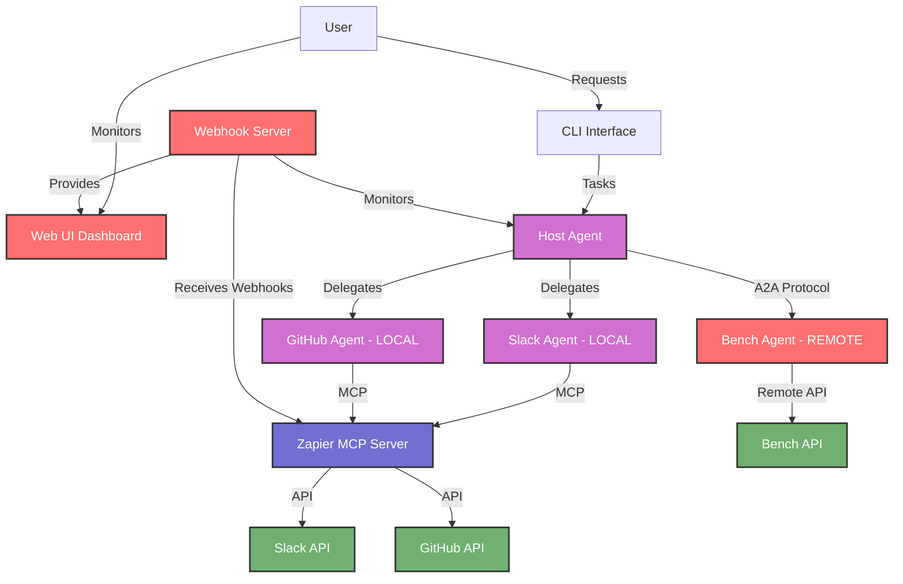
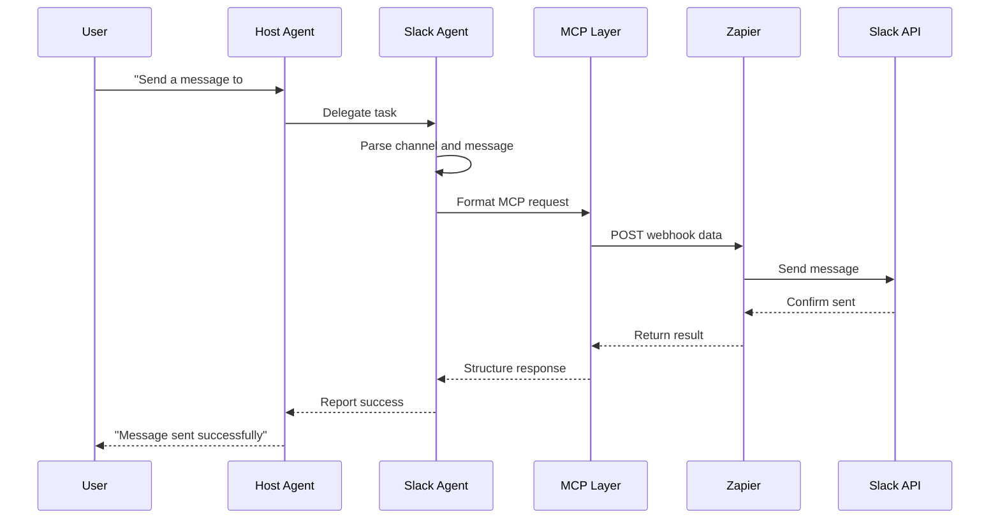
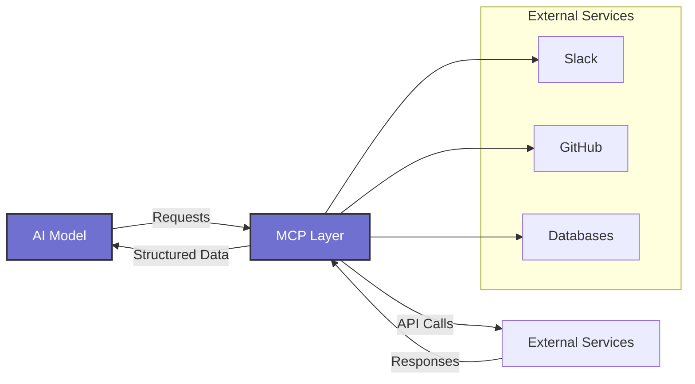

# A2A-MCP Integration Workshop

This project demonstrates how to build a multi-agent system using Agent-to-Agent (A2A) communication with the Model Context Protocol (MCP).

## Features

This workshop demonstrates a multi-agent system with:

- **Host Agent**: Orchestrates requests between specialized agents
- **Slack Agent**: Send messages to Slack channels (local)
- **GitHub Agent**: Create issues, PRs, and manage repositories (local)
- **Bench Agent**: Provides technical assistance and project insights (remote)
- **Webhook Server**: HTTP server that processes incoming webhooks and delegates to appropriate agents

## Overview

The repository contains:

1. A Host Agent that intelligently routes user requests to specialized sub-agents
2. Three specialized agents:
   - **Slack Agent**: Send messages to Slack channels (runs locally)
   - **GitHub Agent**: Create issues in GitHub repositories (runs locally)
   - **Bench Agent**: Provides technical assistance and project insights (runs remotely)

The local agents connect to external services via the Model Context Protocol (MCP), while the remote Bench agent is accessed via A2A protocol over HTTP. This demonstrates a hybrid architecture where some agents run in your local environment while others can be accessed as remote services.

## Architecture

```
┌─────────────┐     ┌───────────────┐
│             │     │ Slack Agent   │
│             ├────►│ (Port 41243)  │──► Slack Channels
│ Host Agent  │     │ [LOCAL]       │
│ (Port 41240)│     └───────────────┘
│             │     ┌───────────────┐
│  CLI        ├────►│ GitHub Agent  │──► GitHub Issues
│  Interface  │     │ (Port 41245)  │
│             │     │ [LOCAL]       │
│             │     └───────────────┘
│             │     ┌───────────────┐
│             ├────►│ Bench Agent   │──► Bench API
└─────────────┘     │ (Remote URL)  │
                    │ [REMOTE]      │
                    └───────────────┘
                    ┌───────────────┐
                    │ Webhook Server│──► Web UI Dashboard
                    │ (Port 3000)   │    Monitoring & Debug
                    └───────────────┘
```

### System Flow Diagram



### Slack Agent Flow



### A2A vs MCP

- **A2A (Agent-to-Agent)**: Protocol for communication between AI agents
- **MCP (Model Context Protocol)**: Protocol for connecting AI models to external services
- **Together**: They create a powerful ecosystem for building multi-agent systems with external integrations

This workshop demonstrates a **hybrid architecture**:
- **Local Agents** (Host, Slack, GitHub): Run on your machine and connect to external services via MCP
- **Remote Agents** (Bench): Run on external infrastructure and are accessed via A2A protocol over HTTP

This approach allows you to:
- Keep sensitive operations local while leveraging remote AI capabilities
- Scale individual agents independently
- Demonstrate both local and distributed agent architectures
- Show how A2A protocol enables seamless communication regardless of agent location



## Prerequisites

- Node.js 18+
- npm or pnpm
- A free Zapier account
- A free Gemini API key
- A Slack workspace with admin privileges (for testing)

### Required Zapier MCP Tools

This workshop requires the following Zapier MCP tools to be configured in your Zapier account:

**Slack Integration:**
- **Send Channel Message** - Enables the Slack Agent to send messages to Slack channels

**GitHub Integration:**  
- **Create Issue** - Enables the GitHub Agent to create issues in GitHub repositories

**Setup Instructions:**
1. Log into your free [Zapier MCP account](https://zapier.com/mcp)
2. Navigate to the [Zapier MCP tools section](https://mcp.zapier.com/mcp/servers)
3. Configure the above tools with your Slack workspace and GitHub account
4. Copy the SSE (not the streamable http) MCP server URL from Zapier for use in your `.env` file

## Getting Started

1. Clone the repository
2. Install dependencies:
   ```bash
   npm install
   ```
3. Configure your `.env` file with:
   ```
   MCP_SERVER_URL=your_zapier_mcp_server_url
   BENCH_API_KEY=your_bench_api_key
   GEMINI_API_KEY=your_gemini_api_key
   
   # Agent URLs (configure as needed)
   HOST_AGENT_URL=http://localhost:41240
   SLACK_AGENT_URL=http://localhost:41243
   GITHUB_AGENT_URL=http://localhost:41245
   BENCH_AGENT_URL=http://ec2-54-183-197-218.us-west-1.compute.amazonaws.com:41246
   
   # Slack Configuration
   SLACK_CHANNEL=#test-slack-damien
   ```

Note: The Bench agent is configured to run remotely at the specified URL. Local agents (Host, Slack, GitHub) will be started automatically, while the remote Bench agent is accessed over HTTP.

## Webhook Server & Web UI

The webhook server provides a web-based interface for monitoring and debugging the multi-agent system. It includes a dashboard for real-time stats, webhook testing tools, and agent log viewing.

### Running the Application

The agents and webhook server is automatically started when you run this script

```bash
npm run start:all
```

### Stop all agents and services:

```bash
npm run stop:all
```

### Accessing the Web UI

Once the webhook server is running, access the web dashboard at:

```
http://localhost:3000
```

`Check the startup logs in the logs folder for errors if anything is not working`

### Web UI Features

The dashboard provides several key features:

- **Real-time Statistics**: Monitor webhook processing stats and agent activity
- **Recent Invocations**: View recent webhook calls with status and details
- **Agent Status**: Check the current status of all agents in the system
- **Host Agent Messages**: Debug messages sent from the Host Agent to sub-agents
- **Webhook Testing**: Send test data to specific webhooks and view responses
- **Agent Logs**: Real-time log viewer for all agents with syntax highlighting
- **JSON Formatting**: Format and validate webhook payloads

### Webhook Endpoints

The server provides REST API endpoints:

- `POST /webhook/:id` - Receive webhook data for a specific webhook ID
- `GET /api/webhooks` - List all webhook configurations
- `POST /api/test/webhook/:id` - Test a webhook configuration
- `GET /api/logs/:agent` - Get logs for a specific agent
- `GET /api/stats` - Get webhook processing statistics

## Agents
- Host Agent on port 41240
- Slack Agent on port 41243
- GitHub Agent on port 41245
- Webhook Server on port 3000

**Note**: The Bench agent runs remotely and does not need to be started locally. The system will automatically connect to the remote Bench agent at the configured URL.

All local agents run in the background, with logs stored in the `logs/` directory. The web UI will show different indicators for local vs remote agents.

## Troubleshooting

- View the logs of each agent and webhook server in the logs folder

### Common Issues

- **Zapier webhook configuration issues**
  - Problem: Webhook not receiving data
  - Solution: Verify webhook URL in `.env`

- **Missing or misconfigured Zapier MCP tools**
  - Problem: "Tool not found" or "Integration not available" errors
  - Solution: 
    - Ensure **Send Channel Message** (Slack) and **Create Issue** (GitHub) tools are configured in Zapier
    - Verify your Slack workspace and GitHub account are properly connected in Zapier
    - Check that the MCP server URL in `.env` is correct and active

- **Gemini API key problems**
  - Problem: "API key not valid" errors
  - Solution: Regenerate key and update `.env`

- **Local agent communication failures**
  - Problem: Local agents can't communicate
  - Solution: Check all local agents are running on correct ports

- **Remote Bench agent connectivity issues**
  - Problem: "Failed to connect to remote agent" errors
  - Solution: 
    - Verify `BENCH_AGENT_URL` in `.env` file
    - Check network connectivity to remote server
    - Ensure remote agent is running and accessible
    - Test connectivity with `npm run test:bench`

## Resources

- A2A documentation: https://github.com/google/A2A
- MCP documentation: https://modelcontextprotocol.github.io/
- Zapier: https://zapier.com
- Gemini API: https://aistudio.google.com/app/apikey

## System Architecture

### Decoupled Agent Design

This system implements a fully decoupled architecture where:

1. **Zero Knowledge Design**: Each agent (host and sub-agents) has no direct knowledge about other agents in their code or prompts
2. **Protocol-based Communication**: All interaction happens exclusively through the A2A protocol
3. **Dynamic Discovery**: The Host Agent discovers available agents at runtime
4. **Task Delegation**: Tasks are delegated based on capability matching, not hardcoded routing

This architectural approach provides:
- **Flexibility**: New agents can be added without modifying existing ones
- **Scalability**: The system can grow to include more specialized agents
- **Maintainability**: Each agent can be developed and updated independently
- **Resilience**: The system can function even if some agents are unavailable

### Debugging with Webhook Handler

The system includes a webhook handler server with a web UI for debugging agent interactions:
- Real-time monitoring of agent communication
- Inspection of messages sent between agents
- Testing webhook configurations
- Viewing agent logs

## Component Documentation

Each component has its own detailed documentation:
- [Host Agent](src/agents/host/README.md)
- [Slack Agent](src/agents/slack/README.md)
- [GitHub Agent](src/agents/github/README.md)
- [Bench Agent](src/agents/bench/README.md)
- [Webhook Handler & Web UI](src/webhooks/README.md)