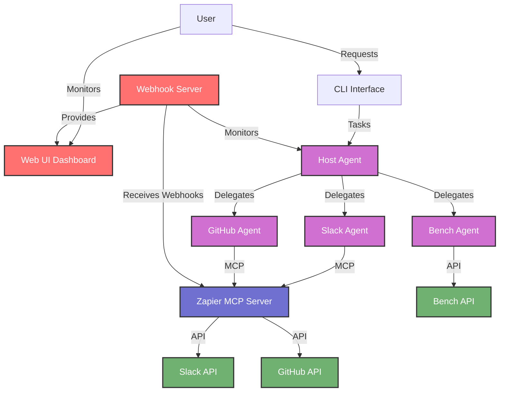
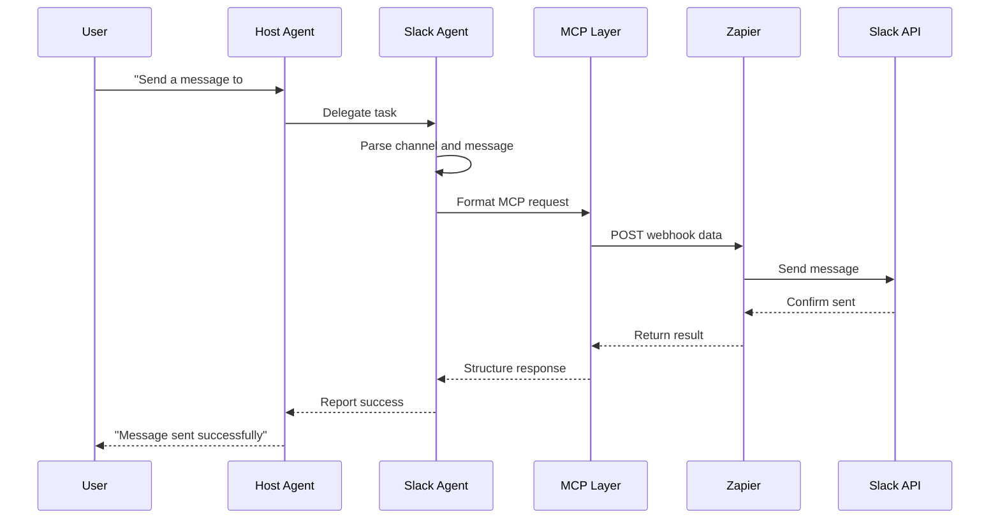
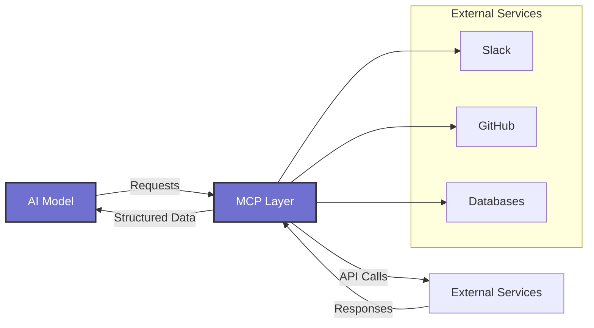

# A2A-MCP Integration Workshop

This project demonstrates how to build a multi-agent system using Agent-to-Agent (A2A) communication with the Model Context Protocol (MCP).

## Features

This workshop demonstrates a multi-agent system with:

- **Host Agent**: Orchestrates requests between specialized agents
- **Slack Agent**: Send messages to Slack channels
- **GitHub Agent**: Create issues, PRs, and manage repositories
- **Bench Agent**: Provides technical assistance and project insights
- **Webhook Server**: HTTP server that processes incoming webhooks and delegates to appropriate agents

## Overview

The repository contains:

1. A Host Agent that intelligently routes user requests to specialized sub-agents
2. Three specialized agents:
   - **Slack Agent**: Send messages to Slack channels
   - **GitHub Agent**: Create issues in GitHub repositories
   - **Bench Agent**: Provides technical assistance and project insights

Each agent connects to its respective service via the appropriate protocol, allowing seamless integration.

## Architecture

```
┌─────────────┐     ┌───────────────┐
│             │     │ Slack Agent   │
│             ├────►│ (Port 41243)  │──► Slack Channels
│ Host Agent  │     └───────────────┘
│ (Port 41240)│     ┌───────────────┐
│             ├────►│ GitHub Agent  │──► GitHub Issues
│  CLI        │     │ (Port 41245)  │
│  Interface  │     └───────────────┘
│             │     ┌───────────────┐
│             ├────►│ Bench Agent   │──► Bench API
└─────────────┘     │ (Port 41246)  │
                    └───────────────┘
                    ┌───────────────┐
                    │ Webhook Server│──► Web UI Dashboard
                    │ (Port 3000)   │    Monitoring & Debug
                    └───────────────┘
```

### System Flow Diagram



### Slack Agent Flow



### A2A vs MCP

- **A2A (Agent-to-Agent)**: Protocol for communication between AI agents
- **MCP (Model Context Protocol)**: Protocol for connecting AI models to external services
- **Together**: They create a powerful ecosystem for building multi-agent systems with external integrations



## Prerequisites

- Node.js 18+
- npm or pnpm
- A free Zapier account
- A free Gemini API key
- A Slack workspace with admin privileges (for testing)

## Getting Started

1. Clone the repository
2. Install dependencies:
   ```bash
   npm install
   ```
3. Configure your `.env` file with:
   ```
   MCP_SERVER_URL=your_zapier_mcp_server_url
   BENCH_API_KEY=your_bench_api_key
   GEMINI_API_KEY=your_gemini_api_key
   ```

## Webhook Server & Web UI

The webhook server provides a web-based interface for monitoring and debugging the multi-agent system. It includes a dashboard for real-time stats, webhook testing tools, and agent log viewing.

### Running the Webhook Server

The webhook server is automatically started when you run all agents:

```bash
npm run start:all
```

To run the webhook server independently:

```bash
npm run webhook:server
```

The server runs on port 3000 by default and can be configured via the `PORT` or `WEBHOOK_PORT` environment variables.

### Accessing the Web UI

Once the webhook server is running, access the web dashboard at:

```
http://localhost:3000
```

### Web UI Features

The dashboard provides several key features:

- **Real-time Statistics**: Monitor webhook processing stats and agent activity
- **Recent Invocations**: View recent webhook calls with status and details
- **Agent Status**: Check the current status of all agents in the system
- **Host Agent Messages**: Debug messages sent from the Host Agent to sub-agents
- **Webhook Testing**: Send test data to specific webhooks and view responses
- **Agent Logs**: Real-time log viewer for all agents with syntax highlighting
- **JSON Formatting**: Format and validate webhook payloads

### Webhook Endpoints

The server provides REST API endpoints:

- `POST /webhook/:id` - Receive webhook data for a specific webhook ID
- `GET /api/webhooks` - List all webhook configurations
- `POST /api/test/webhook/:id` - Test a webhook configuration
- `GET /api/logs/:agent` - Get logs for a specific agent
- `GET /api/stats` - Get webhook processing statistics

### Stopping the Webhook Server

To stop the webhook server:

```bash
npm run webhook:kill
```

Or use the general stop command to stop all services:

```bash
npm run stop:all
```

## Running the Agents

### Start All Agents

```bash
npm run start:all
```

This starts:
- Host Agent on port 41240
- Slack Agent on port 41243
- GitHub Agent on port 41245
- Bench Agent on port 41246
- Webhook Server on port 3000

All agents run in the background, with logs stored in the `logs/` directory.

### Chat with the Host Agent

After starting all agents, you can interact with the system through the Host Agent:

```bash
npm run a2a:cli
```

The Host Agent intelligently routes your requests to the appropriate specialized agent:

Example prompts:
- **Slack**: "Send a message to the #general channel saying Hello world"
- **GitHub**: "Create a GitHub issue in myrepo with title 'Bug Report'"
- **Bench**: "Provide technical assistance for the project"
- **Multiple Services**: "Send hi to Slack and create a GitHub issue about the message"

### Stop All Agents

To stop all running agents:

```bash
npm run stop:all
```

### Run Individual Agents

You can also run and test agents individually:

```bash
# Run Host agent only
npm run host:agent

# Run Slack agent with direct message
npm run agent:slack "Send a message to #general saying Hello"

# Run GitHub agent with direct message
npm run agent:github "Create an issue in repo/name with title 'Test'"

# Run Bench agent with direct message
npm run agent:bench "Provide technical assistance for the project"
```

## Testing

Individual agent tests:

```bash
npm run test:slack
npm run test:github
npm run test:bench
```

Test the Host Agent with all sub-agents:

```bash
npm run test:host
```

## Troubleshooting

### Common Issues

- **Zapier webhook configuration issues**
  - Problem: Webhook not receiving data
  - Solution: Verify webhook URL in `.env`

- **Gemini API key problems**
  - Problem: "API key not valid" errors
  - Solution: Regenerate key and update `.env`

- **Agent communication failures**
  - Problem: Agents can't communicate
  - Solution: Check all agents are running on correct ports

### Debugging

- Check log files in the `logs/` directory
- Test agents individually before testing the entire system
- Verify your `.env` file has the correct values

## Resources

- A2A documentation: https://github.com/google/A2A
- MCP documentation: https://modelcontextprotocol.github.io/
- Zapier: https://zapier.com
- Gemini API: https://aistudio.google.com/app/apikey

## System Architecture

### Decoupled Agent Design

This system implements a fully decoupled architecture where:

1. **Zero Knowledge Design**: Each agent (host and sub-agents) has no direct knowledge about other agents in their code or prompts
2. **Protocol-based Communication**: All interaction happens exclusively through the A2A protocol
3. **Dynamic Discovery**: The Host Agent discovers available agents at runtime
4. **Task Delegation**: Tasks are delegated based on capability matching, not hardcoded routing

This architectural approach provides:
- **Flexibility**: New agents can be added without modifying existing ones
- **Scalability**: The system can grow to include more specialized agents
- **Maintainability**: Each agent can be developed and updated independently
- **Resilience**: The system can function even if some agents are unavailable

### Debugging with Webhook Handler

The system includes a webhook handler server with a web UI for debugging agent interactions:
- Real-time monitoring of agent communication
- Inspection of messages sent between agents
- Testing webhook configurations
- Viewing agent logs

## Component Documentation

Each component has its own detailed documentation:
- [Host Agent](src/agents/host/README.md)
- [Slack Agent](src/agents/slack/README.md)
- [GitHub Agent](src/agents/github/README.md)
- [Bench Agent](src/agents/bench/README.md)
- [Webhook Handler & Web UI](src/webhooks/README.md)