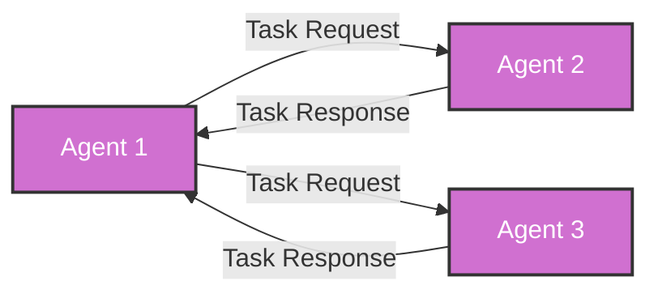
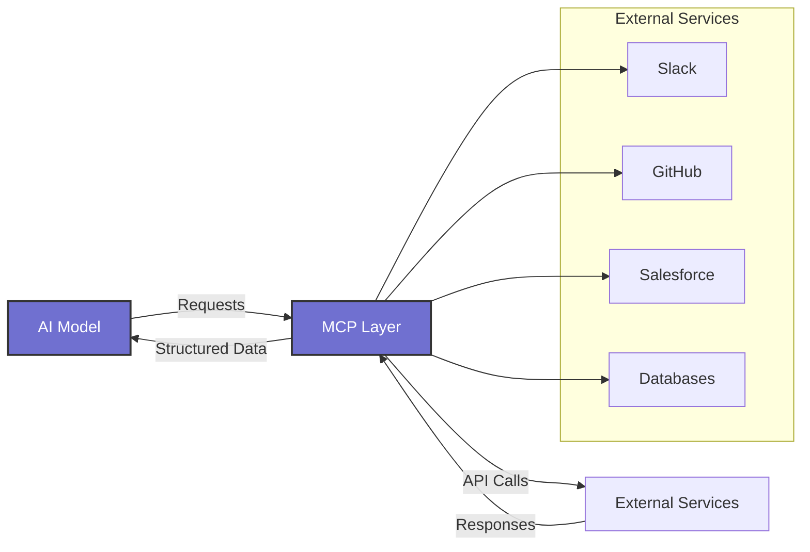
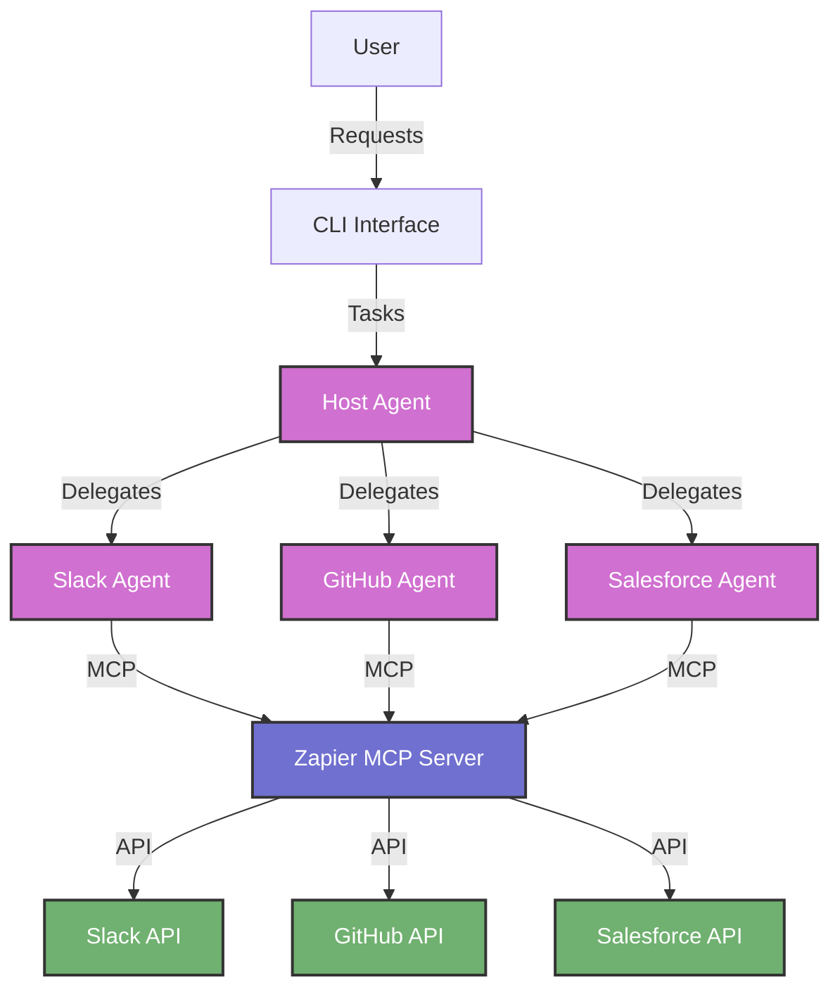
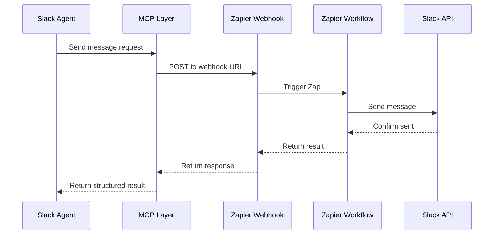
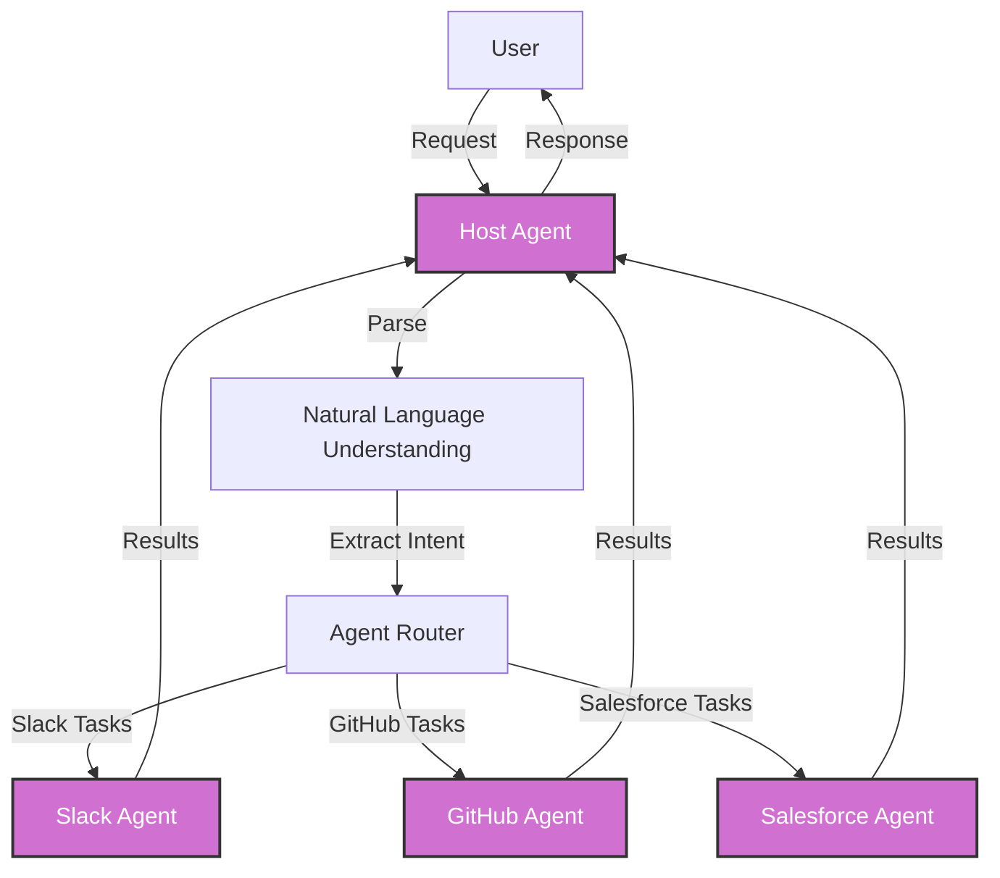
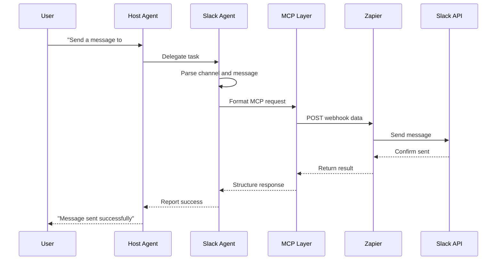
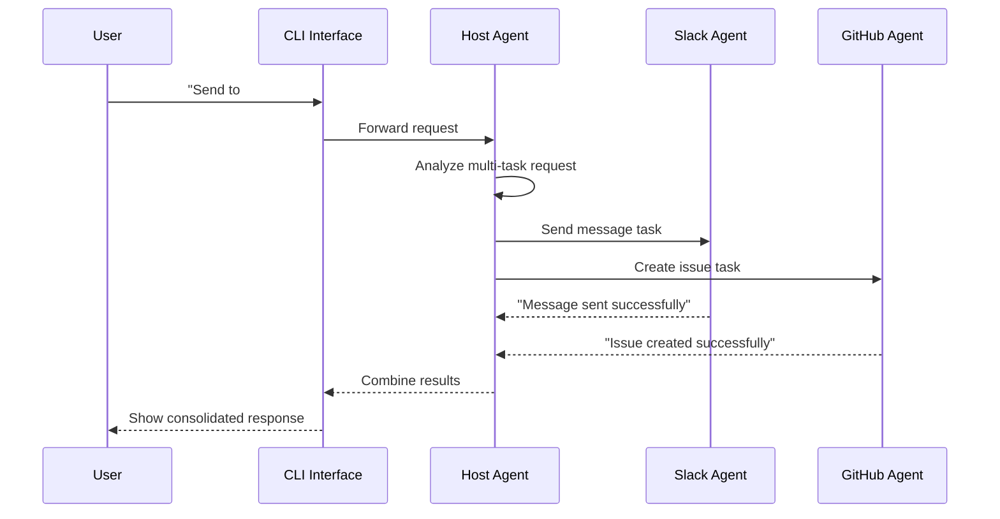
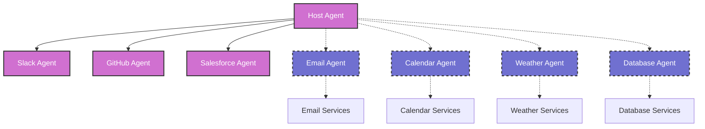

# A2A-MCP Integration Workshop

## Pre-Workshop Setup (To be shared with attendees before the workshop)

### Prerequisites
- Node.js 18+ installed
- npm or pnpm installed
- Git installed
- A free Zapier account (register at https://zapier.com)
- A free Gemini API key (obtain from https://aistudio.google.com/app/apikey)
- A Slack workspace with admin privileges (for testing)
- Clone repository from https://github.com/DamienBench/a2a-mcp-webhook-workshop
- Run `npm install` in the repository directory

## Workshop Content

### Phase 1: Introduction (15 minutes)

#### Slide 1: Workshop Introduction
- Title: "Building Multi-Agent Systems with A2A and MCP"
- Presenter: Damien Murphy
- Company: Bench - Autonomous AI startup (Bay Area)
- Image: *A professional headshot of presenter with Bench company logo in the background, modern tech aesthetic*

#### Slide 2: About Bench
- Founded in the Bay Area
- Backed by Sutter Hill Ventures
- Focus on Autonomous AI systems
- Image: *Bench company overview with illustrations of AI agents working autonomously, company headquarters, and brief timeline*

#### Slide 3: Workshop Goals
- Build a multi-agent system using A2A (Agent-to-Agent) communication
- Integrate external services via MCP (Model Context Protocol)
- Create specialized agents that work together
- Learn when to use A2A vs. MCP
- Image: *Visual roadmap of workshop objectives with checkpoints and final goal visualization*

#### Slide 4: A2A Communication Explained
- Definition: Protocol for AI agents to communicate with each other
- Key benefits:
  - Agent specialization
  - Task delegation
  - Parallel processing
  - Complex workflows
- Image: *Diagram showing multiple AI agents communicating, with speech bubbles containing structured JSON data*



#### Slide 5: MCP Explained
- Definition: Protocol for connecting AI models to external tools and services
- Key benefits:
  - Standardized interface
  - Service integration without API coding
  - Plugin architecture
  - Enhanced AI capabilities
- Image: *Diagram showing MCP as a bridge between AI models and various external services with plugin connectors*



#### Slide 6: When to Use A2A vs. MCP
- A2A: For agent-to-agent communication and task delegation
  - Use when: Building multi-agent systems, complex workflows
- MCP: For connecting agents to external services
  - Use when: Integrating with APIs, accessing tools, fetching external data
- Together: Creating a complete ecosystem
  - A2A handles agent communication
  - MCP handles service integration
- Image: *Venn diagram showing A2A and MCP domains, with overlap illustrating how they complement each other*

### Phase 2: Repository Overview and Setup (25 minutes)

#### Slide 7: Repository Architecture
- Multi-agent system with Host + Specialized agents
- A2A for inter-agent communication
- MCP for external service integration
- Simple CLI interface for user interaction
- Image: *Repository structure diagram showing components, files, and their relationships*



#### Slide 8: Code Structure Overview
- Main components:
  - Host agent (`src/host/`)
  - Specialized agents (`src/agents/`)
  - MCP integration (`src/mcp/`)
  - A2A implementation (`src/server/, src/client/`)
  - CLI interface (`src/cli.ts`)
- Image: *Code directory structure visualization with color-coded components*

#### Slide 9: Environment Setup
- Clone repository: `git clone https://github.com/DamienBench/a2a-mcp-webhook-workshop`
- Install dependencies: `npm install` or `pnpm install`
- Configure `.env`:
  ```
  MCP_SERVER_URL=your_zapier_mcp_server_url
  GEMINI_API_KEY=your_gemini_api_key
  ```
- Image: *Terminal showing commands being executed with successful outputs*

### Phase 3: Zapier MCP Setup (20 minutes)

#### Slide 10: Zapier Overview
- Zapier as an MCP server
- No-code way to connect AI agents to external services
- How webhooks work with MCP
- Image: *Zapier dashboard screenshot with webhook and integration elements highlighted*

#### Slide 11: Creating a Zapier Account
- Sign up at https://zapier.com (free tier)
- Verify email
- Navigate to dashboard
- Image: *Zapier signup page and welcome dashboard*

#### Slide 12: Setting Up Slack Integration
- Create a new Zap
- Choose webhook trigger
- Configure Slack action
- Get webhook URL
- Image: *Step-by-step Zap creation for Slack with annotations*



#### Slide 13: MCP Webhook Data Structure
- Example webhook payload:
  ```json
  {
    "instructions": "Send a message to the #general channel saying Hello world",
    "channel": "#general",
    "message": "Hello world"
  }
  ```
- Zapier data mapping
- Response format
- Image: *JSON data structure visualization with arrows showing how fields map to Zapier actions*

#### Slide 14: GitHub & Salesforce Integration (Overview)
- Similar pattern to Slack
- GitHub webhook configuration
- Salesforce webhook configuration
- Image: *Side-by-side comparison of GitHub and Salesforce Zap configurations*

### Phase 4: Gemini Setup (15 minutes)

#### Slide 15: Gemini API Overview
- What is Gemini (Google's AI model)
- How it powers our agents
- API key usage
- Image: *Gemini logo with AI capabilities visualization*

#### Slide 16: Obtaining Gemini API Key
- Visit https://aistudio.google.com/app/apikey
- Create a free account
- Generate an API key
- Copy key for later use
- Image: *Google AI Studio interface with API key generation process highlighted*

#### Slide 17: Configuring Gemini in the Project
- Add Gemini API key to `.env`
- How the project uses Gemini:
  - Agent reasoning
  - Natural language understanding
  - Task planning
- Image: *Code snippet showing Gemini integration with annotations*

### Phase 5: Agent Deep Dive (40 minutes)

#### Slide 18: Host Agent Architecture
- Central coordinator for the system
- Routes user requests to specialized agents
- Handles agent discovery and management
- Processes multi-agent tasks
- Image: *Host agent architecture diagram with routing logic visualization*



#### Slide 19: Host Agent Code Walkthrough
- Key files:
  - `src/host/index.ts`: Main server implementation
  - `src/host/genkit.ts`: Gemini integration
  - `src/host/host_agent.prompt`: Agent instructions
- Key functions:
  - Agent discovery
  - Task routing
  - Response handling
- Image: *Code snippet of the most important host agent logic with annotations*

#### Slide 20: Slack Agent Deep Dive
- Primary focus of the workshop
- Architecture and components
- MCP integration with Zapier
- Message formatting
- Image: *Slack agent component diagram with message flow visualization*



#### Slide 21: Slack Agent Code Walkthrough
- Key files:
  - `src/agents/slack/index.ts`: Main agent implementation
  - `src/agents/slack/genkit.ts`: Slack-specific tools
  - `src/mcp/slack.ts`: MCP integration
- Key functions:
  - Message parsing
  - Channel validation
  - Error handling
- Image: *Code snippet showing the core Slack agent functionality with annotations*

#### Slide 22: GitHub Agent Overview
- Purpose: Create issues in GitHub repositories
- Components and architecture
- MCP integration with Zapier
- Issue formatting
- Image: *GitHub agent workflow diagram showing issue creation process*

#### Slide 23: Salesforce Agent Overview
- Purpose: Manage Salesforce records
- Components and architecture 
- MCP integration with Zapier
- Record operations (create, find, update)
- Image: *Salesforce agent workflow diagram showing record management process*

### Phase 6: Live Demo (15 minutes)

#### Slide 24: Running the System
- Start all agents: `npm run start:all`
- CLI interface: `npm run a2a:cli`
- Logs location: `logs/` directory
- Image: *Terminal showing agents starting up with successful initialization messages*

#### Slide 25: Demo Scenarios
- Single-agent tasks:
  - "Send a message to #general saying Hello from the workshop!"
  - "Create a GitHub issue in my-repo titled 'Test from A2A Workshop'"
  - "Create a Contact in Salesforce with FirstName Workshop and LastName Attendee"
- Multi-agent tasks:
  - "Send a message to #general and create a GitHub issue about it"
- Image: *CLI interface showing example commands and responses with colored output*



### Phase 7: Troubleshooting (10 minutes)

#### Slide 26: Common Issues and Solutions
- Zapier webhook configuration issues
  - Problem: Webhook not receiving data
  - Solution: Verify webhook URL in `.env`
- Gemini API key problems
  - Problem: "API key not valid" errors
  - Solution: Regenerate key and update `.env`
- Agent communication failures
  - Problem: Agents can't communicate
  - Solution: Check all agents are running on correct ports
- Image: *Troubleshooting decision tree with common error messages and resolution paths*

#### Slide 27: Debugging Tools
- Log files in `logs/` directory
- Using `console.log` statements
- Testing individual agents
- Image: *Example log output with important sections highlighted for debugging*

### Phase 8: Q&A and Discussion (30 minutes)

#### Slide 28: Open Q&A
- Questions about:
  - A2A communication
  - MCP integration
  - Agent architecture
  - Zapier configuration
  - Project extension
- Image: *Q&A session visualization with diverse question topics illustrated*

#### Slide 29: Extension Possibilities
- Adding new specialized agents
- Integrating with different services
- Enhancing the Host Agent's routing logic
- Implementing authentication
- Image: *Ecosystem expansion diagram showing potential new agents and integrations*



#### Slide 30: Resources and Next Steps
- GitHub repository: https://github.com/DamienBench/a2a-mcp-webhook-workshop
- A2A documentation: https://github.com/google/A2A
- MCP documentation: https://modelcontextprotocol.github.io/
- Bench website: https://bench.io
- Image: *Resource links with QR codes for easy access and follow-up materials*

#### Slide 31: Thank You
- Contact information
- Feedback form QR code
- Image: *Thank you slide with contact information and stylized A2A-MCP project logo* 